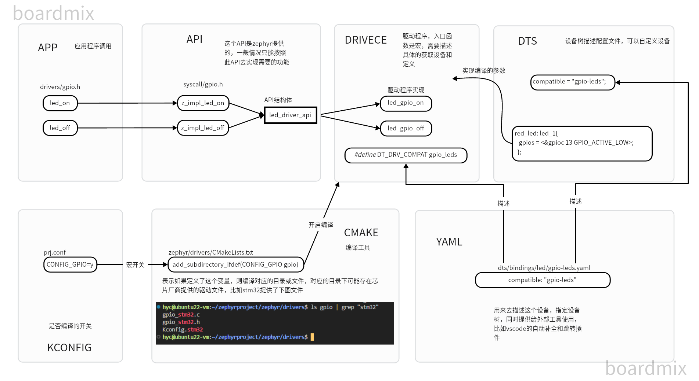
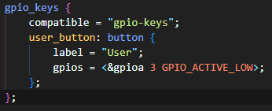
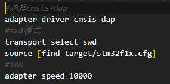

# Zephyr的学习代码
## Zephyr设备树结构图

## 环境
linux： zephyr

windows： vscode + remote 
## 编译
```shell
mkdir 00_helloworld/build && cd 00_hello_world/build
cmake -GNinja ..
ninja
```
## 烧录
方法1
```shell
ninja flash
```
直接烧录没问题，但是代码中使用```k_msleep()```时候会出现无法连接的情况，因此有以下代替方案

方法2
```shell
# 窗口1
openocd -f openocd.cfg
# 窗口2
telnet localhost 4444
program /home/hyc/zephyrproject/hyc/build/zephyr/zephyr.elf reset
```
在nrf提供的开发板当中，板子自带jlink，但是需要安装对应的驱动，烧录的时候直接使用官方版的就行，即输入
```shell
ninja flash
或
west flash
```
前提是需要构建过一次代码`cmake -GNinja ..`,用来生成可以执行的ninja文件，使用west的话就比较轻松，实际上就是将cmake和ninja的命令制作成脚本

## 板子
自定义的pedal，基本与stm32f103_mini板子相同

- dts

- openocd


